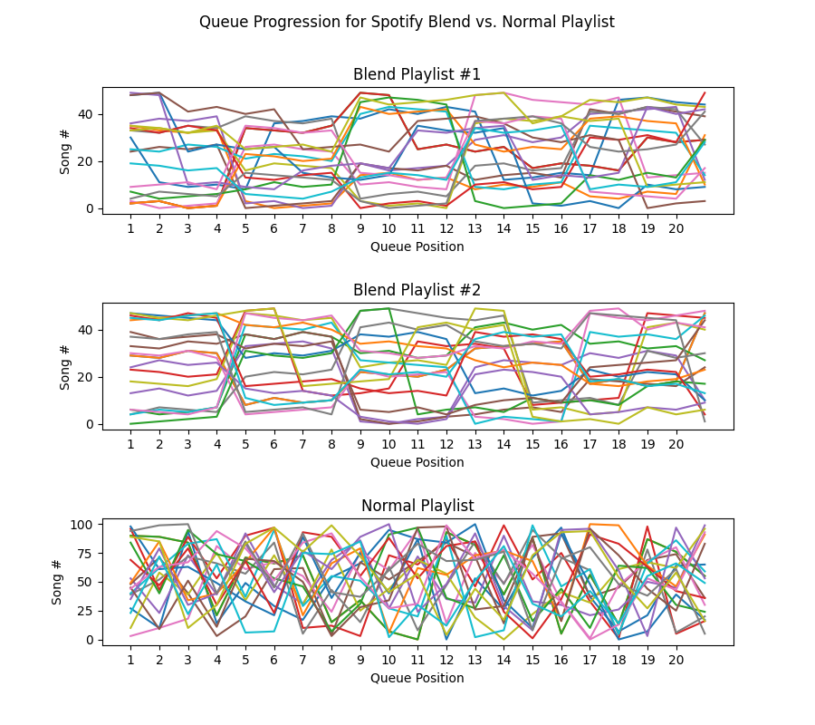

# Spotify Blend Queue Analyzer

I SWEAR I'M NOT CRAZY. EVERY TIME I PLAY A [SPOTIFY BLEND](https://spotify.design/article/spotify-blend-designing-for-a-social-listening-experience) PLAYLIST IT PLAYS SONGS CONGREGATED IN THE SAME _LOCATION_ IN THE PLAYLIST.

THIS PROVES ME **RIGHT**.

## The Data

### Comparing some Blend playlists with a normal playlist

### All Trials

(For Blend Playlist #2)

## License

This repo is licensed under the GPL v3.0.